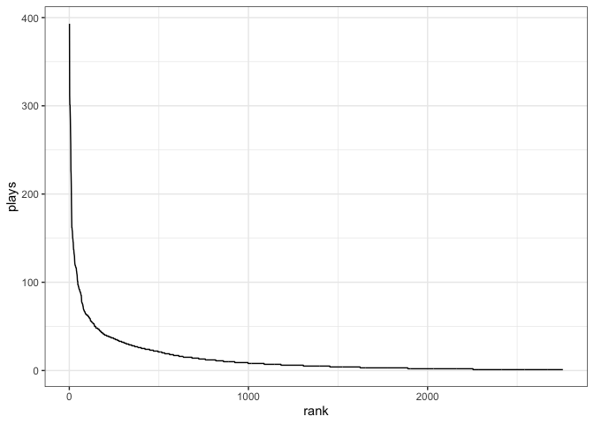

Exploring song plays
================
Renata Diaz

-   <a href="#about-the-song-plays-data"
    id="toc-about-the-song-plays-data">About the song plays data</a>
-   <a href="#glancing-at-the-data" id="toc-glancing-at-the-data">Glancing
    at the data</a>
-   <a href="#plotting-the-rank-abundance-distribution-of-song-plays"
    id="toc-plotting-the-rank-abundance-distribution-of-song-plays">Plotting
    the rank-abundance distribution of song plays</a>

# About the song plays data

This is a dataset of how many times I’ve played each song in my music
library, which I got by importing my data and doing a little bit of
preliminary data cleaning.

# Glancing at the data

``` r
songs_data <- read.csv("https://raw.githubusercontent.com/eco-evo-thr-2022/05-simple-metrics/hill/song_plays.csv")

head(songs_data)
```

    ##                          song rank plays
    ## 1 Dark Bird (St. Lucia Remix)    1   393
    ## 2                    Delicate    2   312
    ## 3        Almost (Sweet Music)    3   301
    ## 4                  The Archer    4   301
    ## 5                       Angel    5   293
    ## 6                       Clean    6   284

There are a total of 2755 songs in the dataset, and a total of 37912
plays accounted for.

# Plotting the rank-abundance distribution of song plays

``` r
ggplot(songs_data, aes(rank, plays)) +
  geom_line()
```

<!-- -->
